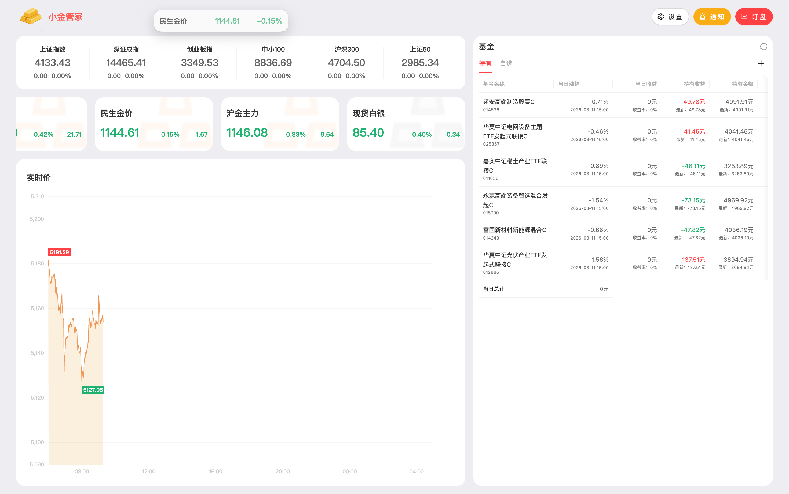
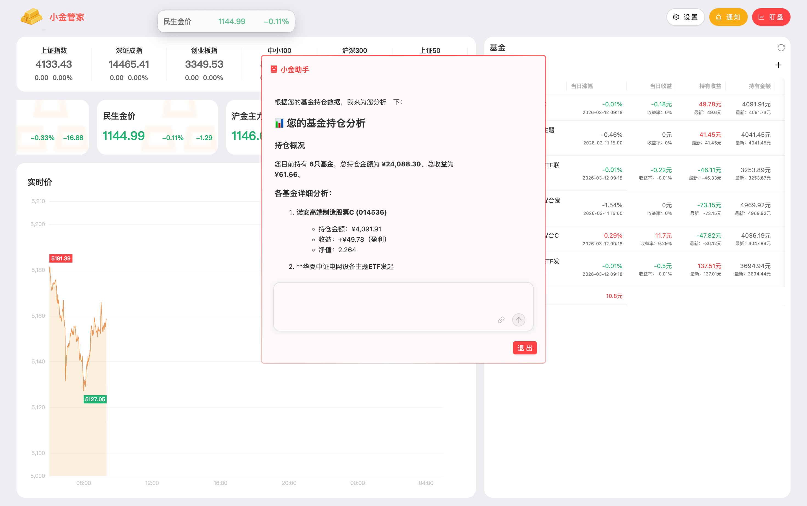
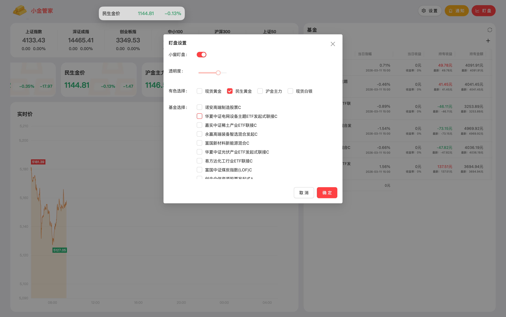
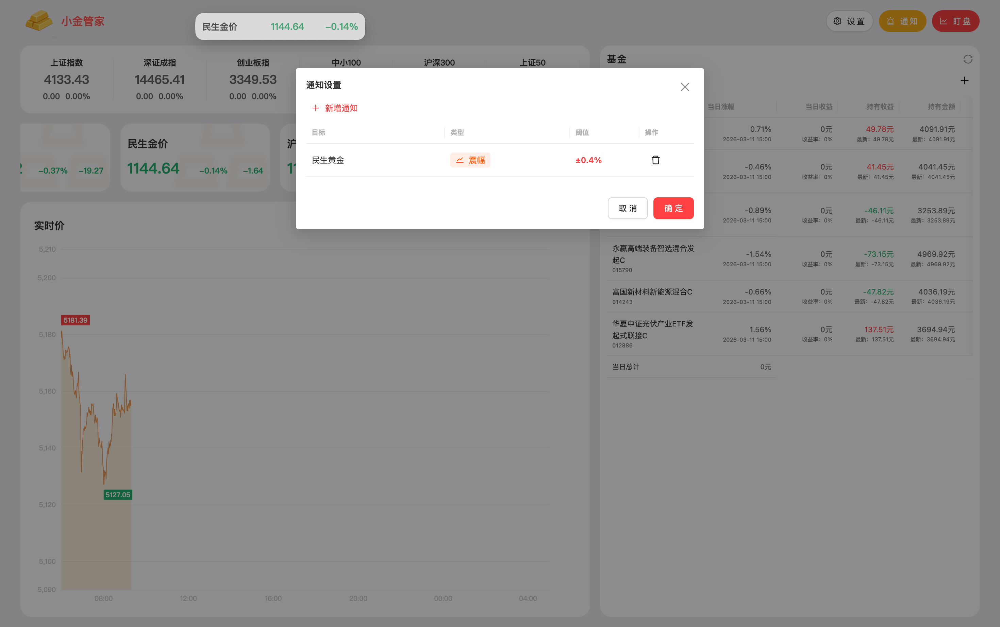

# 小金管家

**小金管家**—— 一个可以盯盘基金以及黄金涨跌的软件。

投资有风险，入市需谨慎！

## Info

所有数据均从开放Api获取，不构成任何投资理财建议。

## Features

本软件具有以下特点：

- 基金实时涨跌，实时数据
- 黄金实时涨跌，实时数据
- 基金盈亏估算
- 基金、黄金浮窗盯盘
- 基金、黄金提醒设置
- 可配置AI智能助手小金

### 软件页面

 
 
 

### AI智能助手

- 可通过描述最新数据，让AI更新基金的持有等数据情况；也可通过AI新增或者删除基金。
 
 
 

### 小窗盯盘设置

- 可设置盯盘某个有色或者基金的实时情况，也可调节小窗透明度。
 
 
 

### 提醒设置

- 可设置针对与莫个基金或者有色设置振幅提醒。